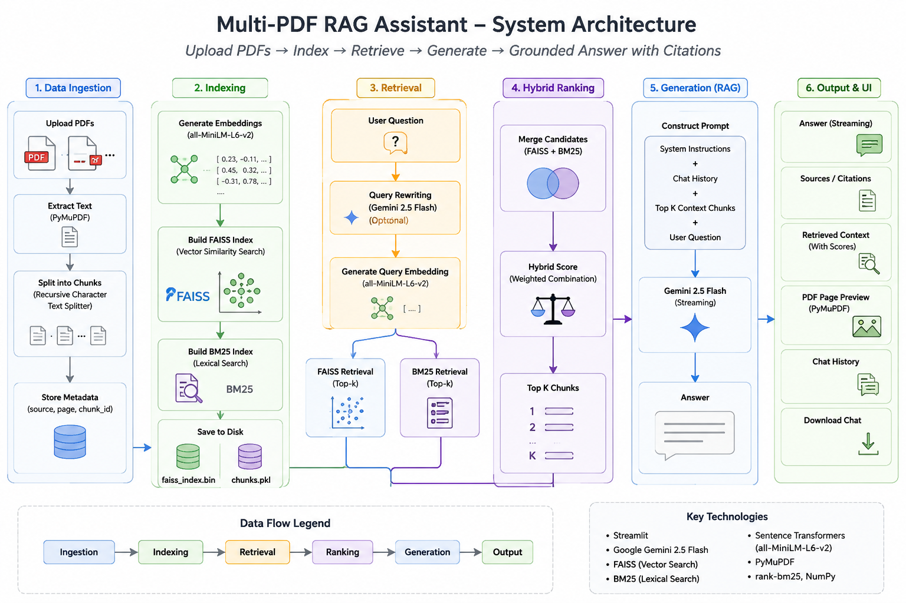
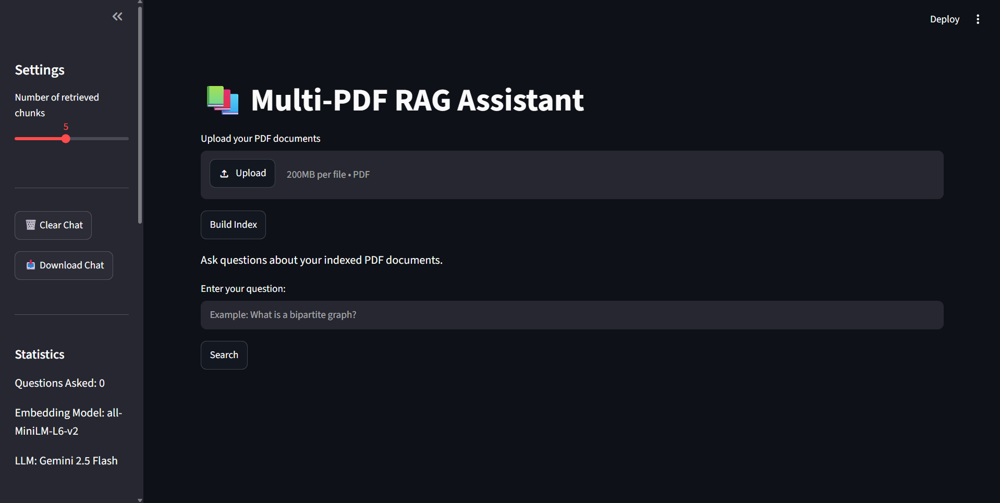
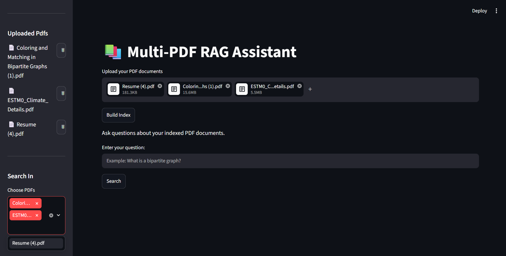
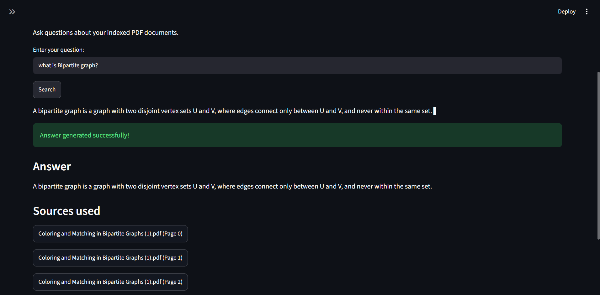
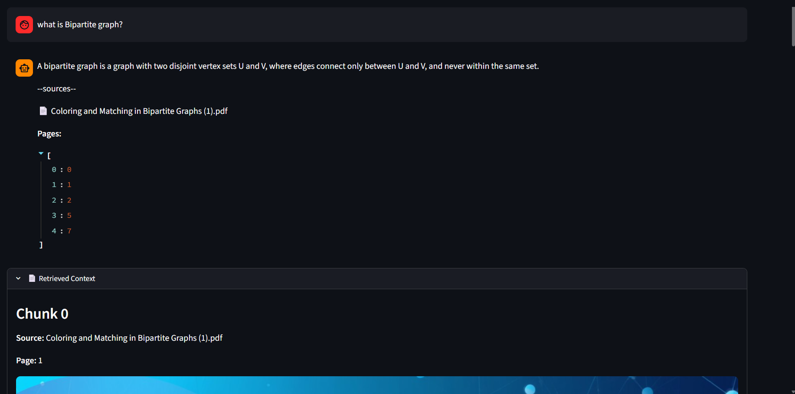
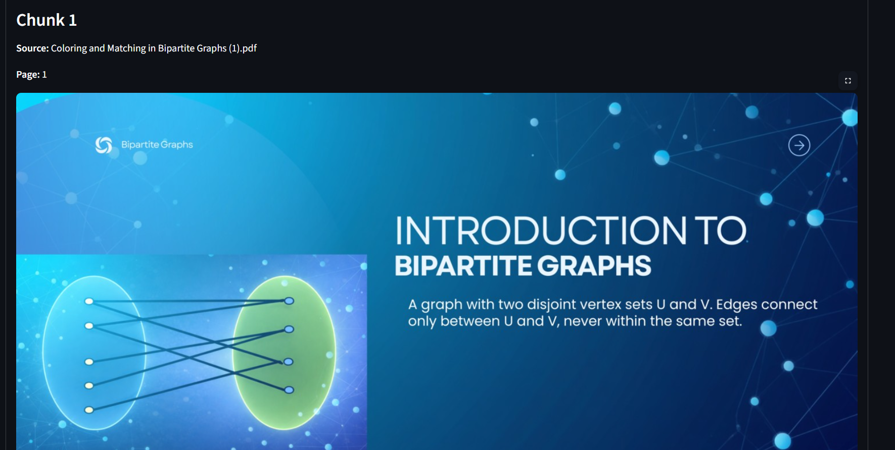
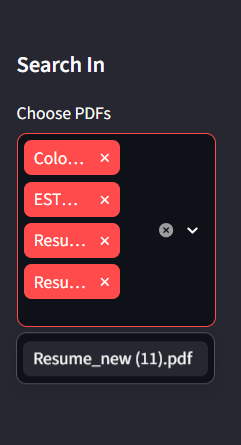

# 📚 Multi-PDF RAG Assistant

<p align="center">
  
</p>

<p align="center">
  <b>A Retrieval-Augmented Generation (RAG) application for querying multiple PDF documents using Google Gemini, FAISS, and BM25.</b>
</p>

<p align="center">


</p>

---

# 📖 Overview

**Multi-PDF RAG Assistant** is an intelligent document question-answering system that enables users to upload multiple PDF files and ask natural language questions grounded in their contents.

Instead of relying on the language model's general knowledge, the application retrieves the most relevant document passages using **Hybrid Search (FAISS + BM25)** and then generates answers using **Google Gemini 2.5 Flash**.

Every response is accompanied by:

* Source document
* Page number
* Retrieved context
* Similarity score
* PDF page preview

This makes the generated answers transparent, verifiable, and trustworthy.

---

# ✨ Features

## 📄 Document Management

* Upload multiple PDF documents
* Automatic indexing of uploaded PDFs
* Delete PDFs and rebuild the index
* Search only selected PDFs

---

## 🔍 Intelligent Retrieval

* Semantic Search using FAISS
* Keyword Search using BM25
* Hybrid Retrieval
* Query Rewriting using Gemini
* Adjustable Top-K retrieval

---

## 🤖 AI Answer Generation

* Google Gemini 2.5 Flash
* Streaming answer generation
* Conversation-aware responses
* Context-grounded answers
* Source citations

---

## 📑 Explainable Retrieval

* Retrieved chunks viewer
* PDF page preview
* Similarity score visualization
* Source documents
* Page references

---

## 💬 User Experience

* Chat history
* Download chat history
* Clean Streamlit interface
* Sidebar statistics
* Multi-document selection

---

# 🏗️ System Architecture

The Multi-PDF RAG Assistant follows a **Retrieval-Augmented Generation (RAG)** pipeline to answer questions using the uploaded PDF documents instead of relying solely on the language model's internal knowledge.

The complete system architecture is illustrated at the top of this README. The processing pipeline consists of the following stages:

### 1. Document Processing

* Users upload one or more PDF documents.
* Text is extracted using **PyMuPDF**.
* Documents are divided into smaller chunks while preserving page information.
* Each chunk is converted into a dense vector embedding using the **all-MiniLM-L6-v2** Sentence Transformer.
* The embeddings are indexed in **FAISS** for efficient semantic retrieval.

### 2. Query Processing

When a user asks a question:

* The question is optionally rewritten into a standalone query using **Google Gemini 2.5 Flash**.
* This improves retrieval for follow-up questions in a conversation.

### 3. Hybrid Retrieval

The rewritten query is processed by two retrieval methods:

* **FAISS** performs semantic similarity search.
* **BM25** performs keyword-based retrieval.

The retrieved candidates are merged and ranked to obtain the most relevant document chunks.

### 4. Context Construction

The highest-ranked chunks are combined into a context while preserving:

* Source document
* Page number
* Similarity score

Only this retrieved context is provided to the language model.

### 5. Answer Generation

Google Gemini 2.5 Flash generates an answer using only the retrieved context.

If the requested information is not available in the retrieved documents, the assistant explicitly states that the information could not be found.

### 6. Explainable Results

To improve transparency, the application displays:

* Source document(s)
* Page numbers
* Retrieved text chunks
* Similarity scores
* PDF page previews
* Downloadable chat history

This ensures that every generated response can be verified directly against the original documents.


---

# 🖼️ Screenshots

## Home Page



---

## Upload Multiple PDFs



---

## Ask Questions



---

## Retrieved Context



---

## PDF Page Preview



---

## Search Selected PDFs



---

# 🛠️ Technology Stack

| Category              | Technology              |
| --------------------- | ----------------------- |
| Language              | Python                  |
| Frontend              | Streamlit               |
| LLM                   | Google Gemini 2.5 Flash |
| Embedding Model       | all-MiniLM-L6-v2        |
| Vector Search         | FAISS                   |
| Keyword Search        | BM25                    |
| PDF Processing        | PyMuPDF                 |
| Image Rendering       | Pillow                  |
| Environment Variables | python-dotenv           |

---

# 📂 Project Structure

```
rag-assistant/
│
├── app.py
├── rag.py
├── index_builder.py
├── requirements.txt
├── README.md
├── .env.example
├── .gitignore
│
├── screenshots/
│   ├── architecture.png
│   ├── home.png
│   ├── upload.png
│   ├── query.png
│   ├── context.png
│   ├── preview.png
│   └── pdf-selection.png
│
├── data/
├── faiss_index.bin
└── chunks.pkl
```

---

# 🚀 Installation

## Clone the repository

```bash
git clone https://github.com/rishu7985/multi-pdf-rag-assistant
cd rag-assistant
```

---

## Create a virtual environment

### Windows

```bash
python -m venv .venv
.venv\Scripts\activate
```

### Linux / macOS

```bash
python3 -m venv .venv
source .venv/bin/activate
```

---

## Install dependencies

```bash
pip install -r requirements.txt
```

---

## Configure API Key

Create a `.env` file in the project root.

```
GOOGLE_API_KEY=YOUR_API_KEY_HERE
```

---

## Run the application

```bash
streamlit run app.py
```

---

# 📖 How to Use

1. Launch the application.
2. Upload one or more PDF documents.
3. Build the search index.
4. Select which PDFs should be searched.
5. Enter your question.
6. View the generated answer.
7. Explore retrieved chunks, citations, similarity scores, and PDF page previews.

---

# 📊 Retrieval Pipeline

The application combines semantic and keyword retrieval:

* **FAISS** retrieves semantically similar document chunks using sentence embeddings.
* **BM25** retrieves chunks with strong keyword overlap.
* Results are merged to improve retrieval quality before being passed to Gemini.

This hybrid approach balances semantic understanding with lexical matching.

---

# 🌟 Key Features Demonstrated

* Retrieval-Augmented Generation (RAG)
* Semantic Search
* Hybrid Search (FAISS + BM25)
* Multi-document Retrieval
* Query Rewriting
* Streaming LLM Responses
* Explainable AI with Citations
* PDF Page Rendering
* Interactive Streamlit Interface

---

# 🔮 Future Improvements

* Cross-Encoder Re-ranking
* OCR support for scanned PDFs
* Metadata filtering
* Vector databases (ChromaDB / Pinecone / Weaviate)
* User authentication
* Cloud deployment
* Multi-user chat sessions
* Citation highlighting inside PDF pages

---

# 🤝 Contributing

Contributions, suggestions, and improvements are welcome.

If you find a bug or have an idea for a new feature, feel free to open an issue or submit a pull request.

---

# 📄 License

This project is released under the MIT License.

---

# 👨‍💻 Author

**Rishabh Yadav**

If you found this project helpful, consider giving it a ⭐ on GitHub.
